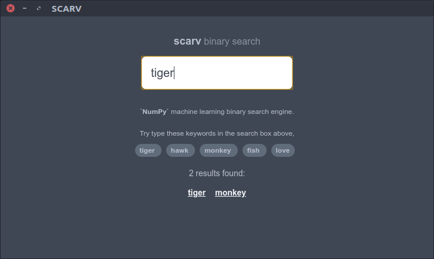
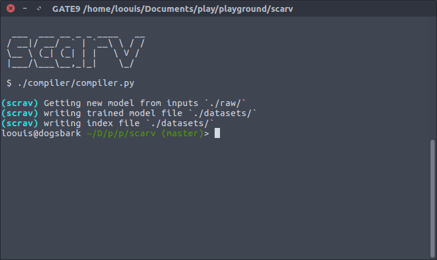

# scarv

A NumPy binary search engine for HTML-based scientific documentation that over hundred of pages. `scrav` is a dream come true for static page.

**Abstracts:** Taking multiple html files text content as inputs put into NumPy array, give it sample error_rate and space-efficient probabilistic data structure been used if samples are too great. Dataset generated in binary for lower-bandwidth footprint, require
external JavaScript module to help reading and download binary datasets file in a web browser.

<p align="left">
  
  
</p>

## repository

clone this repository,

```bash
$ git clone https://github.com/loouislow81/scrav.ai.git

```

## environment

### _create

create Python3 virtual environment,

```bash
$ virtualenv ~/path/to/this/repository -p python3
```

### _run

```bash
$ cd ~/path/to/this/repository/bin
$ source activate
$ cd ../
```

### _install

install python packages,

```bash
$ pip install -r requirements.txt
```
---

## how to

### _input

directory `./raw` is where you put `html` files with text content as inputs, you can giving any name for the html files, the `./compiler/compiler.py` will looks into that `./raw` directory.

### _train

run `compiler` to generate `datasets` and `index` files,

```bash
$ ./compiler/compiler.py
```

### _dataset

generated datasets and index files are in `./datasets` directory.

### _implement

in your `html` page, include these lines to load the micro libraries and settings files before the `</body>` tag,

```html
<script src="js/scarv.js"></script>
<script src="js/stemmer.js"></script>
<script src="js/settings.js"></script>
```

add these lines in the `<body>` tag,

ui to display query entry,

```html
<div id="main"></div>
```

ui to display error message,

```html
<div id="error"></div>
```

ui to display query results,

```html
<div id="results"></div>
```

please use the example `index.html` as reference.

### _unittest

run `test.html` is a unittest that can be monitor in console log with a web browser.

Enjoy!

---

MIT License

Copyright (c) 2019 Loouis Low

Permission is hereby granted, free of charge, to any person obtaining a copy
of this software and associated documentation files (the "Software"), to deal
in the Software without restriction, including without limitation the rights
to use, copy, modify, merge, publish, distribute, sublicense, and/or sell
copies of the Software, and to permit persons to whom the Software is
furnished to do so, subject to the following conditions:

The above copyright notice and this permission notice shall be included in all
copies or substantial portions of the Software.

THE SOFTWARE IS PROVIDED "AS IS", WITHOUT WARRANTY OF ANY KIND, EXPRESS OR
IMPLIED, INCLUDING BUT NOT LIMITED TO THE WARRANTIES OF MERCHANTABILITY,
FITNESS FOR A PARTICULAR PURPOSE AND NONINFRINGEMENT. IN NO EVENT SHALL THE
AUTHORS OR COPYRIGHT HOLDERS BE LIABLE FOR ANY CLAIM, DAMAGES OR OTHER
LIABILITY, WHETHER IN AN ACTION OF CONTRACT, TORT OR OTHERWISE, ARISING FROM,
OUT OF OR IN CONNECTION WITH THE SOFTWARE OR THE USE OR OTHER DEALINGS IN THE
SOFTWARE.
